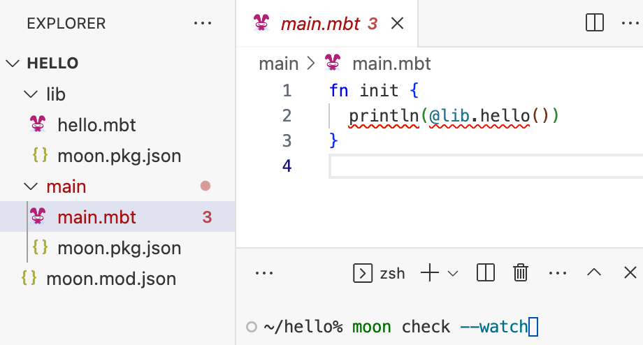

# MoonBit's Build System Tutorial

## Prerequisites

Before you begin with this tutorial, make sure you have installed the following:

1. **MoonBit CLI Tools**: Download it from the <https://www.moonbitlang.com/download/>. This command line tool is needed for creating and managing MoonBit projects.

    Use `moon help` to view the usage instructions.

    ```
    $ moon help
    Moonbit's build system

    Usage: moon <COMMAND>

    Commands:
      build    Build the current package
      check    Check the current package, but don't build object files
      run      Run WebAssembly module
      clean    Remove the target directory
      new      Create a new moonbit package
      bench    Generate build matrix for benchmarking
      fmt      Format moonbit
      version  Print version info and exit
      test     Run the tests
      help     Print this message or the help of the given subcommand(s)

    Options:
      -h, --help  Print help
    ```

2. **Moonbit Language** plugin in Visual Studio Code: You can install it from the VS Code marketplace. This plugin provides a rich development environment for MoonBit, including functionalities like syntax highlighting, code completion, and more.

Once you have these prerequisites fulfilled, let's start building a new module in MoonBit.

## Creating a New Module

To create a new module, use the `moon new hello` command in your terminal:

```bash
$ moon new hello
```

This command will create a new module named `hello`.

## Understanding the Module Directory Structure

After creating the new module, your directory structure should resemble the following:

```bash
.
├── lib
│   ├── hello.mbt
│   └── moon.pkg.json
├── main
│   ├── main.mbt
│   └── moon.pkg.json
└── moon.mod.json
```

Here's a brief explanation of the directory structure:

- `lib` and `main` directories: These are packages in the module. Each package can contain multiple `.mbt` files, which are the source code files in MoonBit language. However, regardless of the number of `.mbt` files in a package, they all share a common `moon.pkg.json` file.

- `moon.pkg.json` is package descriptor. It defines the properties of the package, such as its name, and the packages it imports.

- `moon.mod.json` is used to identify a directory as a MoonBit module. It contains the module's name:

  ```json
  {
    "name": "hello"
  }
  ```

## Checking Your Project

You can open your project with Visual Studio Code. After you've installed the MoonBit plugin, you can use the `moon check --watch` command in your terminal to automatically check your project.



After executing `moon check --watch`, VS Code should look like this.


## Working with Packages

Our `hello` module contains two packages: `lib` and `main`.

The `lib` package contains a `hello.mbt` file:

```rust
pub fn hello() -> String {
    "Hello, world!\n"
}
```

The `main` package contains a `main.mbt` file:

```rust
fn init {
  println(@lib.hello())
}
```

To execute your program, specify the path to the `main` package:

```bash
$ moon run ./main
Hello, world!
```

## Package Importing

In the MoonBit's build system, a module's name is used to reference its internal packages.
To import the `lib` package in `main/main.mbt`, you need to specify it in `main/moon.pkg.json`:

```json
{
  "name": "main",
  "import": {
    "hello/lib": ""
  }
}
```

Here, `"hello/lib": ""` specifies that the `lib` package from the `hello` module is to be imported, and `""` means that `lib` has no name alias.

## Creating and Using a New Package

First, create a new directory named `fib` under `lib`:

```bash
$ mkdir lib/fib
```

Now, you can create new files under `lib/fib`:

`a.mbt`:

```rust
pub fn fib(n : Int) -> Int {
  match n {
    0 => 0
    1 => 1
    _ => fib(n - 1) + fib(n - 2)
  }
}
```

`b.mbt`:

```rust
pub fn fib2(num : Int) -> Int {
  fn aux(n, acc1, acc2) {
    match n {
      0 => acc1
      1 => acc2
      _ => aux(n - 1, acc2, acc1 + acc2)
    }
  }

  aux(num, 0, 1)
}
```

`moon.pkg.json`:

```json
{
  "name": "fib"
}
```

After creating these files, your directory structure should look like this:

```
.
├── lib
│   ├── fib
│   │   ├── a.mbt
│   │   ├── b.mbt
│   │   └── moon.pkg.json
│   ├── hello.mbt
│   └── moon.pkg.json
├── main
│   ├── main.mbt
│   └── moon.pkg.json
└── moon.mod.json
```

In the `main/moon.pkg.json` file, import package `hello/lib/fib`:

```json
{
  "name": "main",
  "import": {
    "hello/lib": "",
    "hello/lib/fib": ""
  }
}
```

This line imports the `fib` package, which is part of the `lib` package in the `hello` module. After doing this, you can use the `fib` package in `main/main.mbt`. Replace the file content of `main/main.mbt` to:

```rust
fn init {
  let a = @fib.fib(10)
  let b = @fib.fib2(11)
  println("fib(10) = \(a), fib(11) = \(b)")
}
```

To execute your program, specify the path to the `main` package:

```bash
$ moon run ./main
fib(10) = 55, fib(11) = 89
```

## Adding tests

In the last, let's add some tests to verify our fib implementation.

First, inside the `lib/fib` directory, create a file named `fib_test.mbt` and paste the following code:

```rust
fn assert_eq[T: Eq](lhs: T, rhs: T) {
  if lhs != rhs {
    abort("")
  }
}

fn init {
  assert_eq(fib(1), 1)
  assert_eq(fib(2), 1)
  assert_eq(fib(3), 2)
  assert_eq(fib(4), 3)
  assert_eq(fib(5), 5)
}
```

This code tests the first five terms of the Fibonacci sequence.

Finally, use the command `moon test` which scans the module, identifying and running all files ending with `_test.mbt`. If everything works, you'll see:

```bash
$ moon test      
test lib/fib ... ok
```
