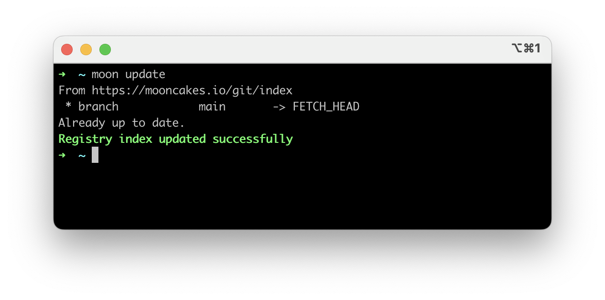
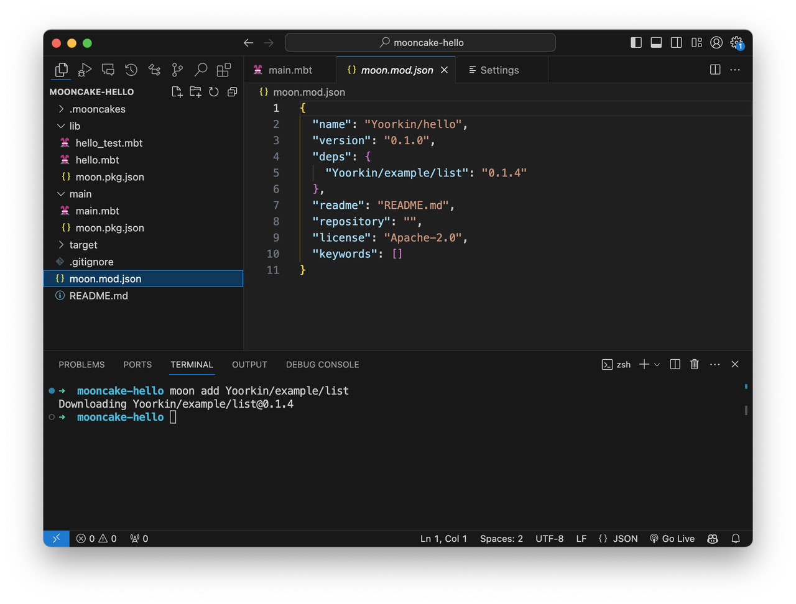
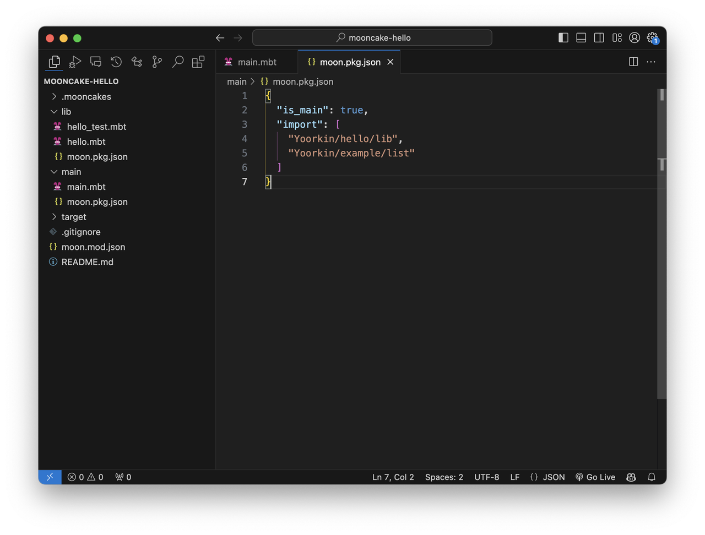
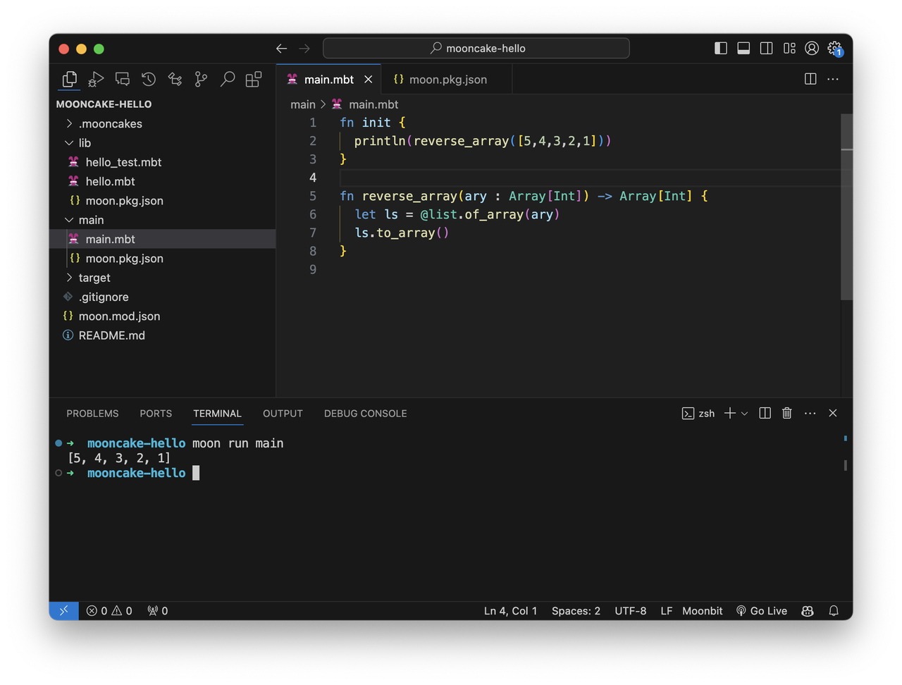

# MoonBit's Package Manager Tutorial

## Overview

MoonBit's build system seamlessly integrates package management and documentation generation tools, allowing users to easily fetch dependencies from mooncakes.io, access module documentation, and publish new modules.

mooncakes.io is a centralized package management platform. Each module has a corresponding configuration file `moon.mod.json`, which is the smallest unit for publishing. Under the module's path, there can be multiple packages, each corresponding to a `moon.pkg.json` configuration file. The `.mbt` files at the same level as `moon.pkg.json` belong to this package.

Before getting started, make sure you have installed [moon](https://www.moonbitlang.com/download/).

## Setup mooncakes.io account

**Note: If you don't need to publishing, you can skip this step.**

If you don't have an account on mooncakes.io, run `moon register` and follow the guide. If you have previously registered an account, you can use `moon login` to log in.

When you see the following message, it means you have successfully logged in:

```
API token saved to ~/.moon/credentials.json
```

## Update index

Use `moon update` to update the mooncakes.io index.



## Setup MoonBit project

Open an existing project or create a new project via `moon new`:


## Add dependencies

You can browse all available modules on mooncakes.io. Use `moon add` to add the dependencies you need, or manually edit the `deps` field in `moon.mod.json`.

For example, to add the latest version of the `Yoorkin/example/list` module:



## Import packages from module

Modify the configuration file `moon.pkg.json` and declare the packages that need to be imported in the `import` field.

For example, in the image below, the `hello/main/moon.pkg.json` file is modified to declare the import of `Yoorkin/example/list` in the `main` package. Now, you can call the functions of the third-party package in the `main` package using `@list`.



You can also give an alias to the imported package:

```json
{
    "is_main": true,
    "import": [
        { "path": "Yoorkin/example/list", "alias": "ls" }
    ]
}
```

Read the documentation of this module on mooncakes.io, we can use its `of_array` and `reverse` functions to implement a new function `reverse_array`.



## Remove dependencies

You can remove dependencies via `moon remove <module name>`.

## Publish your module

If you are ready to share your module, use `moon publish` to push a module to 
mooncakes.io. There are some important considerations to keep in mind before publishing:

### Semantic versioning convention

MoonBit's package management follows the convention of [Semantic Versioning](https://semver.org/). Each module must define a version number in the format `MAJOR.MINOR.PATCH`. With each push, the module must increment the:

- MAJOR version when you make incompatible API changes
- MINOR version when you add functionality in a backward compatible manner
- PATCH version when you make backward compatible bug fixes

Additional labels for pre-release and build metadata are available as extensions to the `MAJOR.MINOR.PATCH` format.


moon implements the [minimal version selection](https://research.swtch.com/vgo-mvs), which automatically handles and installs dependencies based on the module's semantic versioning information. Minimal version selection assumes that each module declares its own dependency requirements and follows semantic versioning convention, aiming to make the user's dependency graph as close as possible to the author's development-time dependencies.


### Readme & metadata

Metadatas in `moon.mod.json` and `README.md` will be shown in mooncakes.io.

Metadatas consists of the following sections:

- `license`: license of this module, it following the [SPDX](https://spdx.dev/about/overview/) convention
- `keywords`: keywords of this module
- `repository`: URL of the package source repository
- `description`: short description to this module
- `homepage`: URL of the module homepage

### Moondoc

mooncakes.io will generate documentation for each modules automatically. 

The leading `///` comments of each toplevel will be recognized as documentation.
You can write markdown inside.

```moonbit
/// Get the largest element of a non-empty `Array`.
/// 
/// # Example
/// 
/// ```
/// maximum([1,2,3,4,5,6]) = 6
/// ```
///
/// # Panics
///
/// Panics if the `xs` is empty.
///
pub fn maximum[T : Compare](xs : Array[T]) -> T {
    //TODO ...
}
```

You can also use `moon doc --serve` to generate and view documentation in local.
