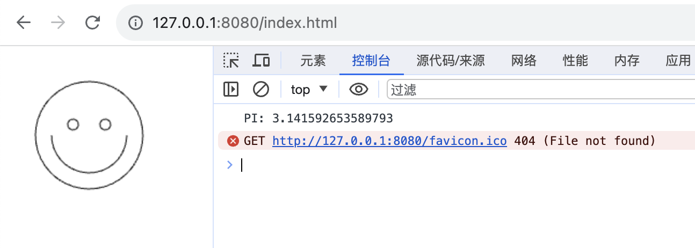

# 外部函数接口 (FFI)

你可以在月兔中通过外部函数接口来使用外部的函数，与宿主环境交互。一般在嵌入浏览器环境或命令行环境（通过[Wasmtime](https://wasmtime.dev/)等项目）时使用。

⚠ 警告：月兔还在初期开发阶段，内容可能会过时。

## 外部函数接口

### 声明外部引用

你可以定义一个这样的外部引用类型：

```rust
type Canvas_ctx
```

这将会定义一个外部对象的引用。在我们的例子中，它代表了宿主JavaScript环境中的一个`CanvasRenderingContext2D`对象。

### 声明外部函数

你可以像这样定义一个外部函数：

```rust
fn get_pi() -> Double = "math" "PI"
```

它和正常的函数定义十分相像，除了函数体被替换为两个字符串。

这两个字符串是用来在Wasm导入的对象中识别特定的函数：第一个字符串是模块名称，第二个字符串是函数名称。

在声明之后，你可以像普通的函数那样使用外部函数。

你也可以定义一个使用外部引用类型的外部函数，就像这样：

```rust
fn begin_path(self: Canvas_ctx) = "canvas" "begin_path"
```

之后可以将它应用到拥有的外部对象的引用上，如：`context.begin_path()`。

### 使用编译的Wasm

使用编译后的Wasm，你需要首先在宿主环境中初始化Wasm模块。这一步需要满足Wasm模块对外部函数的依赖。之后可以使用Wasm模块提供的函数。

#### 提供宿主函数

使用编译后的Wasm，你需要在Wasm导入对象中提供**所有**声明过的外部函数。

例如，在JavaScript中使用包含上述代码片段编译的Wasm：

```js
WebAssembly.instantiateStreaming(fetch("xxx.wasm"), {
  math: {
    get_pi: () => Math.PI,
  },
});
```

具体信息可以查阅嵌入Wasm的宿主环境的文档，例如[MDN](https://developer.mozilla.org/en-US/docs/WebAssembly)。

#### 使用导出的函数

想要导出的函数应当被声明为`pub`。月兔的函数在导出时将根据包名、函数名、是否是方法来生成一个名称。

名称以模块名和包名起始，由`/`分割，例如`module1/lib`。如果它是一个普通函数，那么将会直接跟着`::<定义的函数名>`。否则，它会跟着`<类型>::<方法名>`。如果是泛型函数，那么类型也会被添加，如`<类型>::<方法名>|<类型参数>|`。如果不确定具体规则，可以将Wasm文件转换为文本格式并且搜索`export`命令。

`_start`函数总是应当被使用，以初始化月兔程序中定义的全局实例。

## 例子：笑脸

让我们来看一个使用月兔利用画布（Canvas）API画一个简单笑脸的例子。

```moonbit title="./draw.mbt"
// 我们首先定义一个类型，代表着绘画的上下文
type Canvas_ctx

// 我们再定义外部函数接口
fn begin_path(self : Canvas_ctx) = "canvas" "beginPath"
fn arc(self : Canvas_ctx, x : Int, y : Int, radius : Int, start_angle : Double,
    end_angle : Double, counterclockwise : Bool) = "canvas" "arc"
fn move_to(self : Canvas_ctx, x : Int, y : Int) = "canvas" "moveTo"
fn stroke(self : Canvas_ctx) = "canvas" "stroke"

fn get_pi() -> Double = "math" "PI"
let pi : Double = get_pi()

// 我们使用这些函数来定义一个在绘画上下文中绘制的函数
pub fn draw(self : Canvas_ctx) {
  self.begin_path()
  self.arc(75, 75, 50, 0.0, pi * 2.0, true) // Outer circle
  self.move_to(110, 75)
  self.arc(75, 75, 35, 0.0, pi, false) // Mouth (clockwise)
  self.move_to(65, 65)
  self.arc(60, 65, 5, 0.0, pi * 2.0, true) // Left eye
  self.move_to(95, 65)
  self.arc(90, 65, 5, 0.0, pi * 2.0, true) // Right eye
  self.stroke()
}

// 我们在这里也演示`println`的功能
pub fn display_pi() {
  println("PI: \(pi)")
}

```

使用`moonc`来编译文件，以获得`draw.wasm`。我们推荐尽可能地使用wasm-gc特性。如果宿主环境不支持，那么可以省略`-wasm-gc`选项。

```bash
moonc compile draw.mbt -wasm-gc -o draw.wasm 
```

在JavaScript中使用它：

```html title="./index.html"
<html lang="en">
  <body>
    <canvas id="canvas" width="150" height="150"></canvas>
  </body>
  <script>
    // 定义宿主函数的导入对象
    const importObject = {
      // TODO
    }

    const canvas = document.getElementById("canvas");
    if (canvas.getContext) {
      const ctx = canvas.getContext("2d");
      WebAssembly.instantiateStreaming(fetch("draw.wasm"), importObject).then(
        (obj) => {
          // 总是调用_start来初始化环境
          obj.instance.exports._start();
          // 将JS对象当作参数传递以绘制笑脸
          obj.instance.exports["Canvas_ctx::draw"](ctx);
          // 显示PI的值
          obj.instance.exports["display_pi"]();
        }
      );
    }
  </script>
</html>
```

对于导入对象，我们需要提供先前定义的程序中用到的外部函数接口：画布的绘制接口、数学接口以及`println`和`print`使用的往控制台输出的接口。

对于画布的接口和数学接口，我们可以用以下代码，把对象的方法转化为一个函数，使得第一个参数是对象；并且将对象的常值转化为一个获得该值的函数：

```javascript
function prototype_to_ffi(prototype) {
  return Object.fromEntries(
    Object.entries(Object.getOwnPropertyDescriptors(prototype))
      .filter(([_key, value]) => value.value)
      .map(([key, value]) => {
        if (typeof value.value == 'function')
          return [key, Function.prototype.call.bind(value.value)]
        // TODO: 我们也可以将属性转化为getter和setter
        else
          return [key, () => value.value]
      })
  );
}

const importObject = {
  canvas: prototype_to_ffi(CanvasRenderingContext2D.prototype),
  math: prototype_to_ffi(Math),
  // ...
}
```

至于我们的输出功能，我们可以定义如下的闭包：它提供了一个缓存来存储字符串的字节，直到需要被输出到控制台为止：

```javascript
const [log, flush] = (() => {
  var buffer = [];
  function flush() {
    if (buffer.length > 0) {
      console.log(new TextDecoder().decode(new Uint8Array(buffer).valueOf()));
      buffer = [];
    }
  }
  function log(ch) {
    if (ch == '\n'.charCodeAt(0)) { flush(); }
    else if (ch == '\r'.charCodeAt(0)) { /* noop */ }
    else { buffer.push(ch); }
  }
  return [log, flush]
})();

const importObject = {
  // ...
  spectest: {
    print_char: log
  },
}

// ...
WebAssembly.instantiateStreaming(fetch("draw.wasm"), importObject).then(
  (obj) => {
    obj.instance.exports._start();
    // ...
    flush()
  }
);
```

现在我们可以把之前的内容结合起来，获得我们最终的`index.html`：

```html title="./index.html
<!DOCTYPE html>
<html>

<head></head>

<body>
  <canvas id="canvas" width="150" height="150"></canvas>
  <script>
    function prototype_to_ffi(prototype) {
      return Object.fromEntries(
        Object.entries(Object.getOwnPropertyDescriptors(prototype))
          .filter(([_key, value]) => value.value)
          .map(([key, value]) => {
            if (typeof value.value == 'function')
              return [key, Function.prototype.call.bind(value.value)]
            else
              return [key, () => value.value]
          })
      );
    }

    const [log, flush] = (() => {
      var buffer = [];
      function flush() {
        if (buffer.length > 0) {
          console.log(new TextDecoder().decode(new Uint8Array(buffer).valueOf()));
          buffer = [];
        }
      }
      function log(ch) {
        if (ch == '\n'.charCodeAt(0)) { flush(); }
        else if (ch == '\r'.charCodeAt(0)) { /* noop */ }
        else { buffer.push(ch); }
      }
      return [log, flush]
    })();


    const importObject = {
      canvas: prototype_to_ffi(CanvasRenderingContext2D.prototype),
      math: prototype_to_ffi(Math),
      spectest: {
        print_char: log
      },
    }

    const canvas = document.getElementById("canvas");
    if (canvas.getContext) {
      const ctx = canvas.getContext("2d");
      WebAssembly.instantiateStreaming(fetch("draw.wasm"), importObject).then(
        (obj) => {
          obj.instance.exports._start();
          obj.instance.exports["Canvas_ctx::draw"](ctx);
          obj.instance.exports["display_pi"]();
          flush()
        }
      );
    }
  </script>
</body>

</html>
```

确保`draw.wasm`以及`index.html`在同一个文件夹下，之后在文件夹中启动HTTP服务器，例如使用Python：

```bash
python3 -m http.server 8080
```

在浏览器中打开 http://localhost:8080 后，应该可以看到屏幕上的一个笑脸以及控制台的输出：


