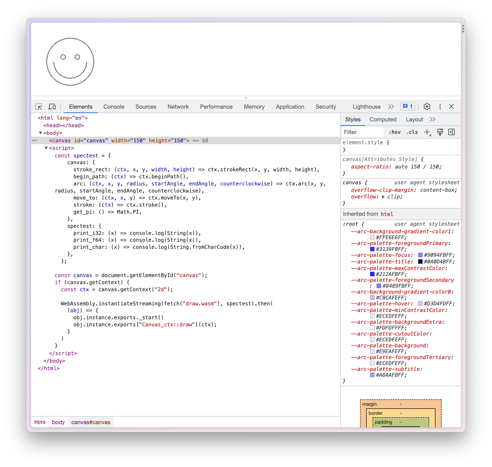

# 外部函数接口 (FFI)

你可以在月兔中通过外部函数接口来使用外部的函数

## FFI

### 声明外部函数

你可以像这样定义一个外部函数：

```rust
fn get_pi() -> Double = "math" "get_pi"
```

它和正常的函数定义十分相像，除了函数体被替换为两个字符串。

这两个字符串是用来在Wasm导入的对象中识别特定的函数：第一个字符串是模块名称，第二个字符串是函数名称。

在声明之后，你可以像普通的函数那样使用外部函数。

### 使用编译的Wasm

使用编译后的Wasm，你需要在Wasm导入对象中提供**所有**声明过的外部函数。

例如，在JavaScript中使用包含上述代码片段编译的Wasm：

```js
WebAssembly.instantiateStreaming(fetch("xxx.wasm"), {
  math: {
    get_pi: () => Math.PI,
  },
});
```

### 完整例子

让我们来看一个使用月兔利用画布（Canvas）API画一个简单笑脸的例子。

```moonbit title="./draw.mbt"
type Canvas_ctx

fn begin_path(self: Canvas_ctx) = "canvas" "begin_path"
fn arc(self: Canvas_ctx, x: Int, y: Int, radius: Int, start_angle: Double, end_angle: Double, counterclockwise: Bool) = "canvas" "arc"
fn move_to(self: Canvas_ctx, x: Int, y: Int) = "canvas" "move_to"
fn stroke(self: Canvas_ctx) = "canvas" "stroke"
fn get_pi() -> Double = "canvas" "get_pi"

let pi: Double = get_pi()

pub fn draw(self: Canvas_ctx) {
    self.begin_path();
    self.arc(75, 75, 50, 0.0, pi * 2.0, true); // Outer circle
    self.move_to(110, 75);
    self.arc(75, 75, 35, 0.0, pi, false); // Mouth (clockwise)
    self.move_to(65, 65);
    self.arc(60, 65, 5, 0.0, pi * 2.0, true); // Left eye
    self.move_to(95, 65);
    self.arc(90, 65, 5, 0.0, pi * 2.0, true); // Right eye
    self.stroke();
}
```

使用`moonc`来编译文件，以获得`draw.mbt.wasm`。

```bash
moonc compile draw.mbt
wat2wasm draw.mbt.wat
```

在JavaScript中使用它：

```html title="./index.html"
<html lang="en">
  <body>
    <canvas id="canvas" width="150" height="150"></canvas>
  </body>
  <script>
    const spectest = {
      canvas: {
        stroke_rect: (ctx, x, y, width, height) =>
          ctx.strokeRect(x, y, width, height),
        begin_path: (ctx) => ctx.beginPath(),
        arc: (ctx, x, y, radius, startAngle, endAngle, counterclockwise) =>
          ctx.arc(x, y, radius, startAngle, endAngle, counterclockwise),
        move_to: (ctx, x, y) => ctx.moveTo(x, y),
        stroke: (ctx) => ctx.stroke(),
        get_pi: () => Math.PI,
      },
      spectest: {
        print_i32: (x) => console.log(String(x)),
        print_f64: (x) => console.log(String(x)),
        print_char: (x) => console.log(String.fromCharCode(x)),
      },
    };

    const canvas = document.getElementById("canvas");
    if (canvas.getContext) {
      const ctx = canvas.getContext("2d");

      WebAssembly.instantiateStreaming(fetch("draw.wasm"), spectest).then(
        (obj) => {
          obj.instance.exports._start();
          obj.instance.exports["Canvas_ctx::draw"](ctx);
        }
      );
    }
  </script>
</html>
```

确保`draw.mbt.wasm`以及`index.html`在同一个文件夹下，之后在文件夹中启动HTTP服务器，例如使用Python：

```bash
python3 -m http.server 8080
```

在浏览器中打开 http://localhost:8080 后，应该可以看到如下的笑脸：


